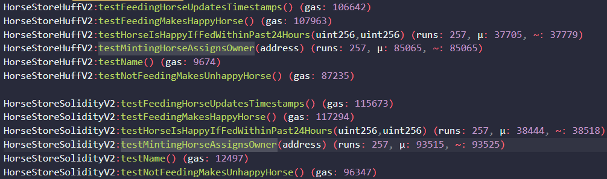

<p align="center">

<br/>

## HUFF

**A low level assembly language for the EVM.**

## Purpose of this repo:

**Use low level language for gas optimization**

## What is included in the repo:

<strong>
<ul>
<li>Solidity</li>
<li>Huff</li>
<li>EVM data interaction mechanism</li>
<li>Forge test and gas snapshot</li>
</ul>
</strong>

**About 10% gas saved for user, at the expense of development speed and potential security**

## Usage

### Build

```shell
$ forge build
```

### Test

```shell
$ forge test
```

### Gas Snapshots

```shell
$ forge snapshot
```

<p align="center">

<br/>
